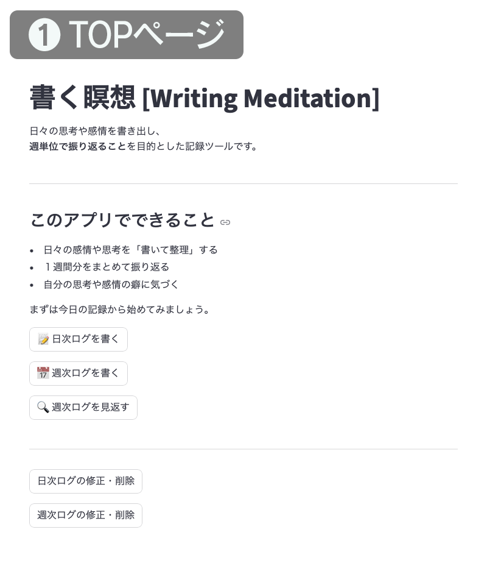
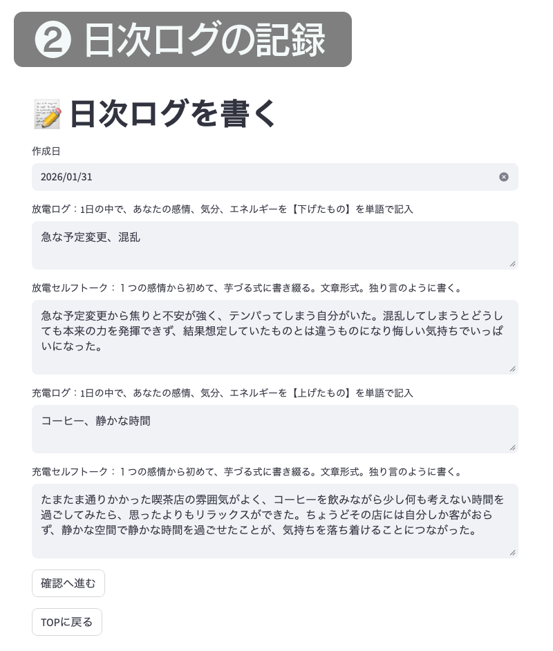
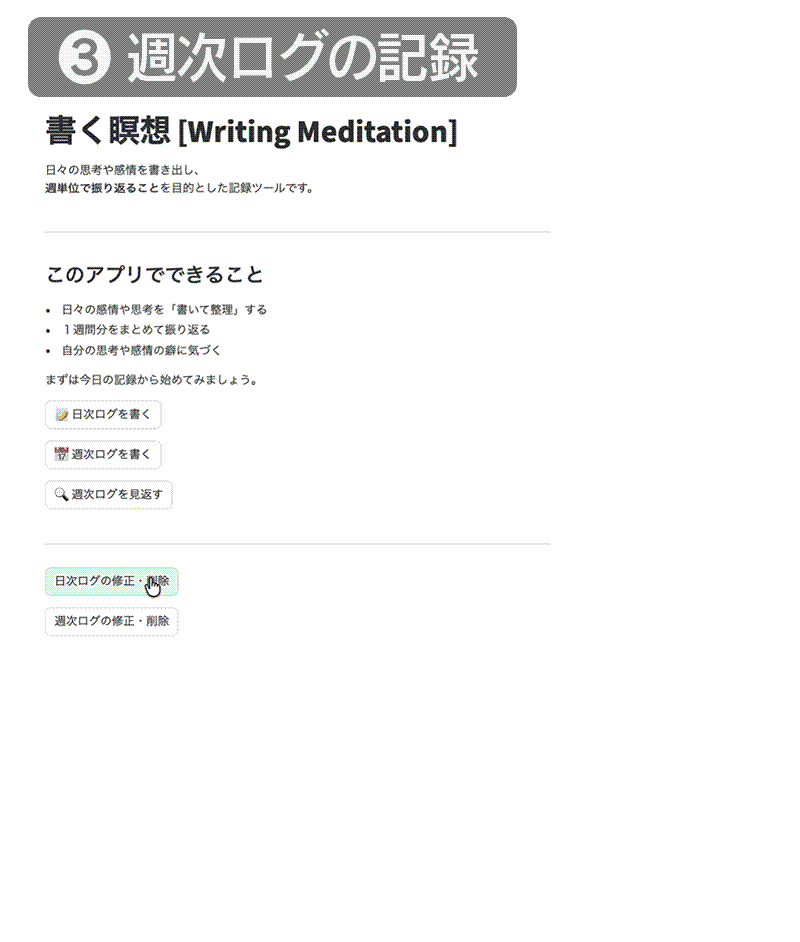
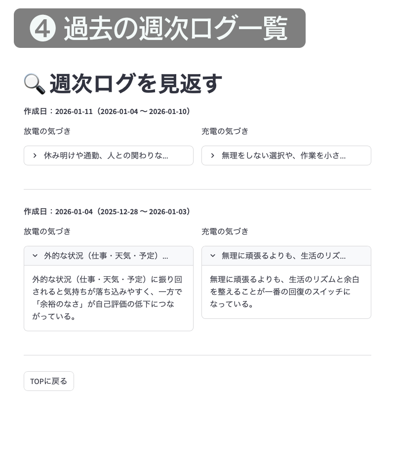

# 書く瞑想　〜Writing Meditation〜

🔗 **WebアプリURL**
[https://writing-meditation.streamlit.app](https://writing-meditation.streamlit.app)


## 目次
本アプリの構成・機能は以下の目次から確認できます。
- [アプリ概要](#アプリ概要)
- [開発背景](#開発背景)
- [使用技術](#使用技術)
- [データベース構成（SQLite）](#データベース構成sqlite)
- [ディレクトリ構造](#ディレクトリ構造)
- [機能一覧](#機能一覧)
- [画面キャプチャ・操作イメージ](#画面キャプチャ操作イメージ)
- [起動方法](#起動方法)
- [開発を通じて得られた知見](#開発を通じて得られた知見)
- [今後の機能拡張について（検討課題）](#今後の機能拡張について検討課題)

---

## アプリ概要

本アプリは、ジャーナリングの一種である「書く瞑想（Writing Meditation）」を
実践するための Web アプリです。

「書く瞑想」とは、感情にフォーカスして「書く」という行動を通じて、
思考や心を整理し、自分自身との対話を深めるためのシンプルなジャーナリング手法です。

本アプリでは、以下のサイクルを継続的に行います。

### 日次（1日15分・朝の実践を想定）
- **放電ログ**  
  1日の中で、感情・気分・エネルギーを【下げた】出来事を「単語」で記録
- **放電セルフトーク**  
  放電ログから湧き上がる感情を起点に、文章として思考を書き出す
- **充電ログ**  
  1日の中で、感情・気分・エネルギーを【上げた】出来事を「単語」で記録
- **充電セルフトーク**  
  充電ログから湧き上がる感情を起点に、文章として思考を書き出す

### 週次（週末の振り返り）
- **放電の気づき**  
  1週間分の放電セルフトークを振り返って得られた気づき
- **充電の気づき**  
  1週間分の充電セルフトークを振り返って得られた気づき

これらを繰り返すことで、思考と感情を整理し、
自身の思考の癖や価値観を見直すきっかけを得ることを目的としています。

※本アプリは、以下の書籍の内容を参考にアプリ化したものです。

- 『書く瞑想 1日15分、紙に書き出すと頭と心が整理される』（古川 武士 著）  
  https://www.amazon.co.jp/dp/4478113033

---

## 開発背景

* 自身が日常的に取り組んでいる「書く瞑想」を、アプリとして実装し実際に使用したいと考えたため
* 紙ベースよりもデータとして蓄積・振り返りができる形にすることで、継続のハードルを下げられると感じたため
* Python初学者として、身近で目的が明確な題材をアプリ化することで、開発の一連の流れを学びたかったため

---

## 使用技術

* Python
* Streamlit
* SQLite

---

## データベース構成（SQLite）

本アプリでは、日次の記録と週次の振り返りを分離して管理するため、
以下の2テーブルで構成されています。

- **daily_log**  
  日々の放電・充電ログおよびセルフトークを記録  
  - `date`
  - `discharge_log`
  - `discharge_talk`
  - `charge_log`
  - `charge_talk`

- **weekly_log**  
  一週間分のログを振り返り、気づきを記録  
  - `date`
  - `start_date`
  - `end_date`
  - `discharge_notice`
  - `charge_notice`

---

## ディレクトリ構造

```
writing_meditation/
├── data/
│   └── app.db                # SQLite データベースファイル
├── docs/
│   └── journal_app_spec.xlsx # 仕様書
├── images/                   # README用キャプチャ画像
│   ├── 01_top.png            
│   ├── 02_daily.png          
│   ├── 03_weekly_extract.gif 
│   └── 04_weekly_list.png    
├── venv/                     # Python 仮想環境
├── insert_dummy_daily.py     # ダミーデータ（日次ログ）投入用スクリプト
├── insert_dummy_weekly.py    # ダミーデータ（週次ログ）投入用スクリプト
├── main.py                   # アプリ本体
├── requirements.txt
└── README.md
```
---

## 機能一覧

### 日次ログ機能

* 放電ログ（気分を下げた出来事）の記録
* 放電セルフトークの作成
* 充電ログ（気分を上げた出来事）の記録
* 充電セルフトークの作成
* 日次ログの修正
* 日次ログの削除

### 週次ログ機能

* 指定期間（1週間）の日次ログ抽出
* 放電の気づきの記録
* 充電の気づきの記録
* 週次ログの修正
* 週次ログの削除
* 過去の週次ログ一覧表示（振り返り用）

※ 動作確認・学習用として、2025年12月28日〜2026年1月31日までのダミーデータを実装しています。

---

## 画面キャプチャ・操作イメージ

### TOPページ
日次ログ・週次ログの作成や、過去ログの確認を行う起点となる画面です。

<p align="center">

</p>


### 日次ログの作成
放電ログ・充電ログを記録し、その内容を元に各セルフトークを記録します。

<p align="center">

</p>


### 週次ログの作成（期間抽出）
対象期間を選択すると、該当する日次ログが一覧表示されます。  
抽出された期間のログを参考に、各気づきを記録します。

<p align="center">

</p>


### 週次ログの確認
作成済みの週次ログを一覧で確認できます。

<p align="center">

</p>

---

## 起動方法

### ローカルでの起動

1. リポジトリをクローンします

```bash
git clone https://github.com/harada-sh-dev/writing_meditation.git
cd writing_meditation
```

2. 必要なライブラリをインストールします

```bash
pip install -r requirements.txt
```

3. アプリを起動します

```bash
streamlit run main.py
```

* 本リポジトリには、アプリの利用イメージを確認するためのダミーデータが登録された SQLite データベース（data/app.db）が含まれています。
* ダミーデータを使用せずに利用したい場合は、`data/app.db`ファイルのみを削除した上でアプリを起動してください。（`data`フォルダ自体は削除しない点に注意）起動時に新しいデータベースが自動生成されます。

※ 本手順は macOS / Windows のいずれでも基本的に同様です。  
※ Python / pip の実行環境によっては、`pip` の代わりに`pip3` または `python -m pip` を使用してください。

---

## 開発を通じて得られた知見

* 課題の選定から、要件定義、設計、実装、テストまで一連の開発プロセスを実際に通すことで、アプリ開発全体の流れを具体的に理解できた。
* 開発においてAIを活用したが、仕様や目的を自身の言葉で整理・言語化することを前提としたため、実装内容や方針について主体的に判断しながら開発を進めることができた。
* Gitを用いたバージョン管理とGitHub Issueによるタスク管理を行い、作業内容を明確に分解・可視化することで、アウトプットを意識した開発プロセスを実践できた。
* 初めてプログラミング言語を用いて開発を行なったため、過度な作り込みよりも機能を絞り、最小構成で完成させることを優先する判断の重要性を学んだ。

---

## 今後の機能拡張について（検討課題）

* 月次、年次単位での振り返り機能の追加
* UI/UXの改善（現在の簡素なデザインから、より使いやすくデザイン性の高い画面へ）
* 頻出ワードの抽出機能の追加（データログからどんな出来事や感情が多いかを分析）
* 日ごとの感情スコア（1〜5段階）を追加し、曜日別・月初／月中／月末の傾向分析を可能にする機能
* AIによる日次ログの分析と、週次ログの生成・提案機能の実装
